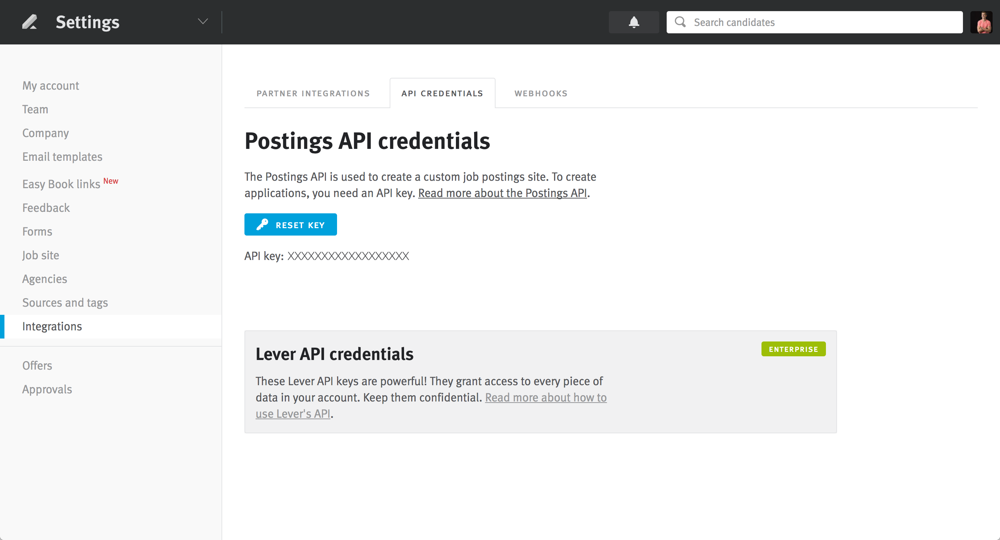
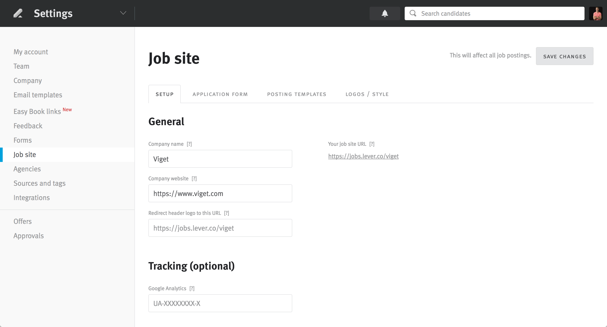
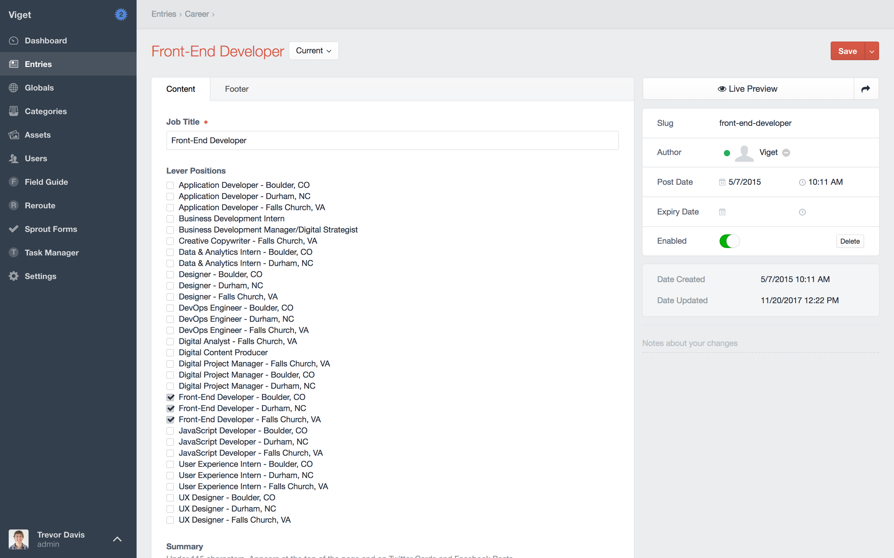

# Lever plugin for Craft CMS

[Lever Hire](https://www.lever.co/) is a powerful recruiting platform to track applicants. Now you can integrate with Lever directly from your [Craft](https://craftcms.com/) site.

## Requirements

This plugin requires Craft CMS 3.0.0-beta.23 or later.

## Installation

To install the plugin, follow these instructions.

1. Open your terminal and go to your Craft project:

        cd /path/to/project

2. Then tell Composer to load the plugin:

        composer require viget/craft-lever

3. In the Control Panel, go to Settings → Plugins and click the “Install” button for Lever.

## Lever Overview

Instead of sending applicants to apply on your Lever site, you can create a form to save applicants right on your Craft site.

## Configuring Lever

1. Copy `src/config.php`
1. Save the file as `config/lever.php`
1. Add your Lever values for `apiKey` and `site`

### Finding Your API Key



[Visit Sections > Integrations > API to find your API Key](https://hire.lever.co/settings/integrations?tab=api)

### Finding Your Site



[Visit Sections > Job site to find your Site](https://hire.lever.co/settings/site). The value you need to use in the config is everything that comes after `https://jobs.lever.co/`. In the screenshot above, the site value is `viget`.

## Using Lever

For applicants to apply to jobs in Lever, you will need to build a form to process these requests. Here is the form in its simplest state:

```
<form method="post" enctype="multipart/form-data">
	{{ getCsrfInput() }}
	<input type="hidden" name="action" value="lever/saveApplicant">
  {{ redirectInput('careers/thanks') }}
	<input type="hidden" name="position" value="1">

	<label for="name">Name</label>
	<input type="text" name="name" id="name" required>

	<label for="email">Email</label>
	<input type="email" name="email" id="email" required>

	...
</form>
```

### Fields

#### `position`
The Lever ID of the position to apply to.

#### `name`
This is a required field.

#### `email`
This is a required field.

#### `urls`
This is an optional field. It will split a `<textarea>` on new lines and submit each URL separately.

#### Optional Fields
You can see additional optional fields in the [Lever Postings API documentation](https://github.com/lever/postings-api#apply-to-a-job-posting).

## Field Type
A Lever Field Type is also available in this plugin. If you want a control panel user to select which position(s) can be applied to, this will provide a list of open positions from Lever in the Craft control panel for a control panel user to select from.



### Front-End Example
```
<label for="position">Position</label>
<select name="position" id="position" required>
	<option value="">Select Position</option>
	
		<option value="{{ opening.leverId }}">{{ opening.leverTitle }}</option>
	
</select>
```
